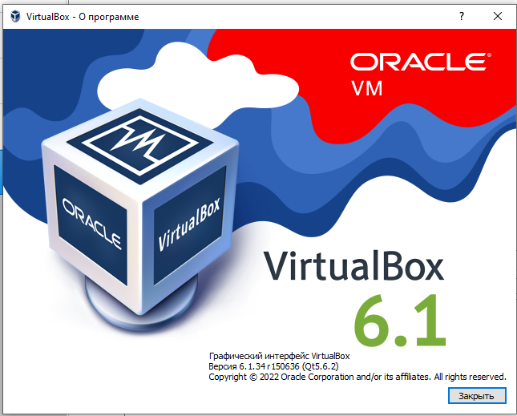
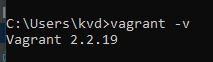
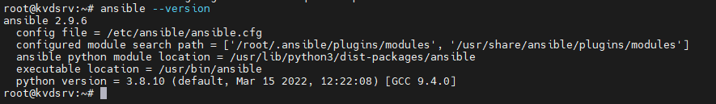

 ## Задача 1
 
Опишите своими словами основные преимущества применения на практике IaaC паттернов.

1. Упрощает взаимодейстивие между отделами ускоряя процесс перехода между разработкой, тестированием и командой развертывания

2. Стандартизирует используемые в разрабоке пакеты, помогает добиться одинаковой среды у разработчиков, тестирования и командой развертывания

3. Быстрота развертывания окружений для все тех же отделов. И соответственно экономия времени на каждом этапе CI/CD

Какой из принципов IaaC является основополагающим?

Идемпотентность - результат повторения операций или свойств объекта остается идентичным предыдущему и все последующим выполнениям (стабильность)

 ## Задача 2

Чем Ansible выгодно отличается от других систем управление конфигурациями?

Тем что использует существующую SSH инфраструктуру. Другие инструменты требуют установки PKI-окружения

Какой, на ваш взгляд, метод работы систем конфигурации более надёжный push или pull?

Push - потому что есть управляющий сервер который отсылает свои конфигурации всем серверам. 
Меньше шанс того что хосты перегрузят сервер запросами

 ## Задача 3

Установить на личный компьютер:

- VirtualBox
- Vagrant
- Ansible

Приложить вывод команд установленных версий каждой из программ, оформленный в markdown.

 ## Задача 4 (*)

Воспроизвести практическую часть лекции самостоятельно.

1. Создать виртуальную машину.

2. Зайти внутрь ВМ, убедиться, что Docker установлен с помощью команды

*docker ps*

